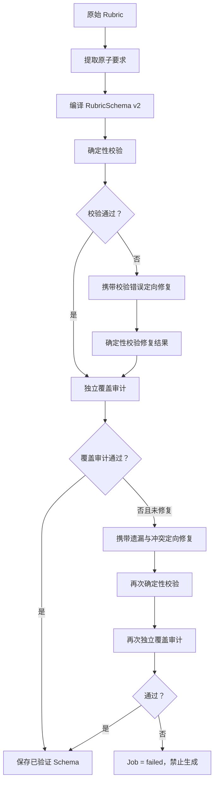

# Rubric Schema v2 与 Prompt Pipe 设计

## 1. 背景

当前答案生成提示词同时注入三份来源相同的评分信息：

1. 由原始评分标准编译出的 `compiledPrompt`；
2. 用户输入的原始 `rubric`；
3. 从 `rubricSchema` 展开的 `rubricChecklist`。

这种防御性重复可以缓解 Schema 编译遗漏，但也会造成 Token 浪费、题目注意力被稀释、答案机械覆盖评分点，以及多份规则冲突时优先级不明确等问题。

本次改造先解决评分规则的单一来源问题，不引入按综合分析、应急处置、组织协调等题型加载 Prompt 的路由。目标是让经过验证的 `RubricSchema v2` 成为生成和审核阶段唯一的评分规则来源，再以 Prompt Pipe 按阶段加载其他必要规则。

## 2. 目标与非目标

### 2.1 目标

- 将原始 Rubric 编译为具有原文映射关系的 `RubricSchema v2`。
- 使用确定性校验和独立模型审计验证 Schema 的结构、分值与语义覆盖。
- 最多执行一次定向修复；修复后仍不合格则禁止生成。
- 答案生成 Prompt 只从已验证的 `RubricSchema v2` 读取评分约束。
- 原始 Rubric 只用于编译、审计、追溯和重新编译。
- `compiledPrompt` 不再参与 v2 任务的答案生成。
- 通过 Prompt Pipe 按条件加载材料、多问题和重试反馈等 Section。
- 审核结果引用稳定的 criterion ID，使重试只加载本轮需要修复的规则。
- 记录 Prompt 管线版本和实际加载的 Section，支持结果追溯。

### 2.2 非目标

- 本阶段不增加题型分类器。
- 本阶段不为不同题型设计专用 Prompt。
- 本阶段不增加管理员人工确认 Schema 的页面。
- 本阶段不立即删除数据库中的 `compiledPrompt` 字段。
- 本阶段不同时改造模型供应商或 Chat Completions 调用方式。

## 3. 总体方案

采用“编译 + 独立覆盖审计”方案：



编译模型负责生成候选 Schema，审计模型负责以原始 Rubric 为唯一依据验证覆盖情况。编译结果不能自证正确。

“提取原子要求”和“编译 Schema”是同一次编译模型调用的两个逻辑步骤。编译响应同时返回 `source_requirements` 和完整候选 Schema，不为原子要求提取额外增加一次模型调用。独立审计必须使用与编译不同的请求上下文；允许使用同一个模型配置，但不能携带编译对话历史或要求审计器延续编译结论。

为控制成本和延迟，整个管线最多执行一次 Schema 定向修复。结构校验失败和覆盖审计失败共享这一次修复预算，而不是各自允许一次修复。

## 4. RubricSchema v2

### 4.1 数据结构

```json
{
  "version": "v2",
  "role_prompt": "你是一名参加公务员结构化面试的考生。",
  "source_requirements": [
    {
      "id": "REQ-001",
      "text": "能够从群众、制度和执行层面分析原因",
      "kind": "criterion"
    },
    {
      "id": "REQ-003",
      "text": "答案必须结合基层工作实际",
      "kind": "global"
    }
  ],
  "global_constraints": [
    {
      "id": "GLB-001",
      "text": "答案必须结合基层工作实际",
      "source_requirement_ids": ["REQ-003"]
    }
  ],
  "dimensions": [
    {
      "id": "DIM-001",
      "name": "综合分析能力",
      "max_score": 30,
      "source_requirement_ids": ["REQ-001"],
      "criteria": [
        {
          "id": "CRI-001",
          "text": "从群众、制度和执行层面分析原因",
          "source_requirement_ids": ["REQ-001"]
        }
      ],
      "pitfalls": [
        {
          "id": "PIT-001",
          "text": "原因分析单一或停留在表面",
          "source_requirement_ids": ["REQ-001"]
        }
      ]
    }
  ],
  "answer_principles": [],
  "retry_policy": [],
  "output_rules": [],
  "compilation": {
    "compiler_model": "model-name",
    "auditor_model": "model-name",
    "coverage_passed": true,
    "inferred_scores": false
  }
}
```

### 4.2 原子要求

`source_requirements` 表示从原始 Rubric 中提取出的最小、可独立验证的业务要求。每项包含：

- 稳定 ID；
- 忠实于原文语义的简洁文本；
- 类型 `kind`。

第一版支持以下 `kind`：

- `dimension`：评分维度或能力名称；
- `criterion`：正向得分要求；
- `pitfall`：扣分点、禁止项或常见失分表现；
- `score`：维度分值或权重要求；
- `global`：适用于所有维度的总体规则。

档位描述中的重复表达应归并为原子要求，不能把“优秀、良好、一般、较差”本身提取成维度。档位描述中独有且具有执行意义的要求仍需保留。

### 4.3 映射规则

- 每条 `source_requirement` 至少被一个 dimension、criterion、pitfall 或全局约束引用。
- 原始 Rubric 中适用于全部维度的业务要求进入结构化 `global_constraints`；系统固定角色和输出格式仍放在基础 Prompt，不伪装成原始要求。
- 每个 criterion 和 pitfall 至少引用一条原始要求。
- 一个原始要求允许映射到多个位置，但生成阶段应去重呈现。
- 模型推导出的通用措辞不能伪装成原文要求；如果属于系统固定规则，应放入基础 Prompt，而不是 `source_requirements`。
- 映射仅表示语义归属，不要求逐字复制原文。
- pitfall 可以是对原文正向 criterion 的忠实反向表达，并引用同一 requirement；不能借此增加原文没有要求的评分标准。

## 5. 分值策略

- 原文明确给出全部维度分值时，Schema 必须忠实使用，总和必须为 100。
- 原文完全未提供分值时，允许编译模型分配权重，但总和必须为 100，并设置 `inferred_scores: true`。
- 原文只给出部分分值、同一维度出现冲突分值或总分规则有歧义时，不允许静默补全。
- 对部分分值或冲突分值，定向修复可重新解释一次；仍无法无歧义确定时编译失败。
- 通过线不参与维度权重推断，只用于后续判断答案是否通过。

## 6. 校验与覆盖审计

### 6.1 确定性校验

程序必须校验：

- Schema 版本为 `v2`；
- 所有 REQ、DIM、CRI、PIT ID 在各自命名空间内唯一；
- 所有引用的 requirement ID 均存在；
- 维度名称唯一且非空；
- 每个维度的 `max_score` 为正整数；
- 每个维度至少包含一个 criterion 和一个 pitfall；
- criterion、pitfall 文本非空；
- 每条原子要求至少被映射一次；
- 所有 criterion 和 pitfall 均有来源映射；
- 所有维度分值总和等于 100；
- `inferred_scores` 与原始分值情况一致；
- 只有审计成功后才能将 `coverage_passed` 设为 true。

确定性校验不得自行修改 Schema。所有修复都必须通过显式的修复步骤完成并重新校验。

### 6.2 独立覆盖审计

审计调用接收：

- 完整原始 Rubric；
- 提取出的 `source_requirements`；
- 候选 `RubricSchema v2`；
- 确定性校验摘要。

审计模型只输出结构化结论，不重新编写 Schema：

```json
{
  "passed": false,
  "missing_requirement_ids": ["REQ-004"],
  "unsupported_schema_paths": ["dimensions[2].criteria[1]"],
  "conflicts": [
    {
      "requirement_id": "REQ-007",
      "schema_path": "dimensions[0].criteria[2]",
      "reason": "Schema 将必须要求弱化成可选要求"
    }
  ],
  "score_issues": [],
  "repair_instructions": ["将 REQ-004 映射到组织协调维度的 criterion"]
}
```

审计失败时，修复调用必须同时接收原始 Rubric、候选 Schema、确定性错误和审计报告，只能针对报告指出的问题修改。修复后重新运行全部确定性校验和独立审计。

## 7. Prompt Pipe

### 7.1 原则

答案生成阶段只有一个评分规则来源：已验证的 `RubricSchema v2`。

以下内容不再进入 v2 生成 Prompt：

- 原始 `rubric`；
- 旧的文本 `compiledPrompt`；
- 与 Schema 内容重复的单独 `rubricChecklist`。

Prompt 由多个职责单一的 Section 按固定顺序组装。Section 决定是否加载和如何呈现，生成器不再维护一段包含所有逻辑的超长模板。

### 7.2 Section 与加载条件

| Section | 加载条件 | 职责 |
| --- | --- | --- |
| `base_role` | 始终 | 考生角色、内部判断作答任务、不暴露推理过程 |
| `rubric_constraints` | 始终 | Schema 维度、criteria、pitfalls |
| `material` | 材料非空 | 当前题目的背景材料 |
| `question` | 始终 | 当前问题文本 |
| `length` | 始终 | 答题时间、目标字数、最小和最大字数 |
| `multi_question` | 确认存在多个子问题 | 逐问完整回答及分段格式 |
| `retry_feedback` | 存在上一轮审核反馈 | 失败 criteria、修复指令和应保留内容 |
| `output_rules` | 始终 | 纯文本、自然口述和禁止事项 |

第一版 Section 顺序固定为：

```text
base_role
rubric_constraints
material（可选）
question
length
multi_question（可选）
retry_feedback（可选）
output_rules
```

### 7.3 评分约束呈现

`rubric_constraints` 直接从 Schema 渲染，每个 criterion 和 pitfall 只呈现一次：

```text
本题必须满足以下评分约束：

综合分析能力（30 分）
- 准确识别核心问题
- 从群众、制度和执行层面分析原因
- 避免只表态、不分析

解决问题能力（40 分）
- 措施明确责任主体、执行动作和反馈方式
- 兼顾短期处置与长效机制
- 避免措施空泛或缺少闭环
```

原始 requirement ID 不向模型展示，criterion ID 可作为内部标签随 Prompt 传递，以支持审核和重试稳定引用，但不得出现在最终答案中。

### 7.4 多问题判断

第一版不使用新的模型调用判断多问题。使用现有题目结构和明确标志进行保守判断，例如多个“问题 N”块或多个显式编号问题。无法确定时不加载 `multi_question`，基础规则仍要求完整回答题目中的所有作答要求。

### 7.5 长度约束

长度 Section 同时传入：

- 答题分钟数；
- `targetMinWords`；
- `targetWords`；
- `targetMaxWords`。

第一阶段仍将长度视为模型软约束，不增加生成后截断或自动扩写，以避免破坏答案语义。后续可以单独增加长度校验与重写管线。

## 8. 审核与重试反馈

### 8.1 审核输出

审核器继续按 Schema 维度评分，同时增加 criterion 级结果：

```json
{
  "dimensions": [
    {
      "dimension_id": "DIM-001",
      "score": 24,
      "max_score": 30
    }
  ],
  "failed_criteria": [
    {
      "criterion_id": "CRI-003",
      "reason": "未分析制度层面的原因",
      "repair_instruction": "补充制度设计、执行机制或监督机制分析"
    }
  ],
  "preserved_criteria_ids": ["CRI-001", "CRI-002"],
  "total_score": 88,
  "passed": false,
  "reasons": ["自然语言审核摘要"]
}
```

程序根据维度得分重新计算总分，并根据任务通过线计算 `passed`，不能直接信任模型给出的总分与通过结论。

### 8.2 重试 Prompt

首次生成不加载 `retry_feedback`。低分重试时只加载：

- `failed_criteria` 指向的 Schema 内容；
- 对应 `repair_instruction`；
- `preserved_criteria_ids` 指向的已满足内容；
- 必要的自然语言补充原因。

重试 Prompt 明确要求定向修复，不完全推翻上一轮有效思路。当前系统没有把上一轮答案传给下一轮，因此“保留有效内容”只能作为生成指导，无法逐句保留。若后续需要精确局部改写，应另行设计将上一轮答案安全注入的方案。

## 9. 数据兼容与迁移

- 数据库继续保留原始 `rubric`，用于审计和重新编译。
- 第一阶段保留 `compiledPrompt` 字段，v2 任务不读取它。
- `rubricSchema` JSONB 升级为带 `version` 的联合结构，代码必须显式识别 v1 和 v2。
- v1 Schema 不得进入精简后的 v2 Prompt Pipe。
- 旧任务需要重新执行 Rubric 编译并通过审计，升级到 v2 后才能重新生成答案。
- 旧任务已有答案和审核记录仍可查看和导出，不要求迁移历史 Attempt。
- 确认线上没有 v1 生成依赖后，再单独设计移除 `compiledPrompt` 字段的迁移。

## 10. 状态与错误处理

评分编译内部阶段为：

```text
extracting_requirements
compiling_schema
validating_schema
auditing_coverage
repairing_schema
auditing_repaired_schema
completed / failed
```

业务 Job 状态继续使用 `compiling_rubric`、`draft` 和 `failed`，不为内部阶段扩充状态枚举。详细阶段与错误使用结构化结果记录：

```json
{
  "stage": "coverage_audit",
  "code": "UNCOVERED_REQUIREMENTS",
  "message": "评分标准存在未映射要求",
  "details": {
    "requirement_ids": ["REQ-004", "REQ-007"]
  }
}
```

Job 增加 `rubricCompilation` JSONB 字段，持久化最后一次编译阶段、结构化错误、编译模型、审计模型和更新时间，以便刷新页面后仍能展示可操作原因。本阶段不建立单独的编译历史表。

以下情况使编译最终失败：

- Schema 结构不合法且修复失败；
- 明确分值总和不等于 100；
- 部分分值或冲突分值无法无歧义确定；
- 存在未映射的原始要求；
- 审计发现 Schema 增加了原文不支持的业务要求；
- 审计发现语义冲突；
- 模型超时、服务错误或返回不可解析内容，并且有限重试后仍失败。

失败后 Job 为 `failed`，运行 API 必须拒绝启动。用户修改 Rubric 或点击重新分析后，完整管线重新开始。

## 11. Prompt 版本与追溯

Prompt 版本由组合信息构成：

```json
{
  "pipeline_version": "generation-pipe-v1",
  "schema_version": "rubric-schema-v2",
  "base_prompt_version": "base-v1",
  "rubric_prompt_version": "rubric-v1",
  "retry_prompt_version": "retry-v1",
  "loaded_sections": [
    "base_role",
    "rubric_constraints",
    "material",
    "question",
    "length",
    "retry_feedback",
    "output_rules"
  ]
}
```

第一版继续将摘要写入现有 `promptVersion`：

```text
generation-pipe-v1+rubric-schema-v2
```

Attempt 增加 `promptMetadata` JSONB 字段保存完整版本和 Section 列表。Review 增加 `failedCriteria` JSONB 与 `preservedCriteriaIds` JSONB 字段，用于持久化 criterion 级反馈。现有 `dimensions` 和 `reasons` 字段继续保留，兼容页面展示与历史记录。日志不得保存 API Key 等敏感配置。

## 12. 测试策略

### 12.1 确定性校验测试

- 接受总分为 100 的合法 Schema；
- 拒绝重复 ID 和重复维度；
- 拒绝空 criteria、空 pitfall 和悬空引用；
- 拒绝未映射的原子要求；
- 拒绝不是 100 的明确总分；
- 原文无分值时允许推断且要求 `inferred_scores: true`；
- 原文只有部分分值时拒绝静默补全。

### 12.2 编译管线测试

- 首次编译和审计直接通过；
- 确定性校验失败，定向修复后通过；
- 覆盖审计发现遗漏，定向修复后通过；
- 修复后再次审计仍失败，Job 进入 failed；
- 编译、审计和修复返回非法 JSON；
- 模型调用超时或 HTTP 错误；
- 整条管线最多执行一次修复。

### 12.3 Prompt Pipe 测试

- v2 最终 Prompt 不包含原始 Rubric；
- v2 最终 Prompt 不包含 `compiledPrompt`；
- 每个 criterion 和 pitfall 只呈现一次；
- 无材料时不加载 `material`；
- 首次生成不加载 `retry_feedback`；
- 重试时加载失败项、修复指令与保留项；
- 单问题不加载多问题 Section；
- 长度 Section 包含最小、目标和最大字数；
- loaded sections 与实际渲染内容一致。

### 12.4 集成与回归测试

- 整批生成和单题重生成均使用新管线；
- 未验证或 v1 Schema 的任务不能开始新的生成；
- Attempt 正确记录 Prompt 管线版本；
- 审核按 dimension ID 和 criterion ID 返回结果；
- 低分反馈进入同一题目的下一轮；
- 不同题目的反馈不会串用；
- 已通过题目不会进入下一轮；
- 历史 v1 任务仍可查看与导出。

## 13. 验收标准

- 答案生成 Prompt 只有一个评分规则来源：通过覆盖审计的 `RubricSchema v2`。
- 原始 Rubric 不出现在 v2 答案生成 Prompt 中。
- `compiledPrompt` 不参与 v2 答案生成。
- 每条原始要求都能追溯到具体维度、criterion、pitfall 或全局原则。
- 所有维度分值总和为 100；分值推断必须显式标记。
- 覆盖审计失败时任务不能进入答案生成。
- 每次答案生成都能追溯 Prompt 管线版本和实际加载 Section。
- 低分重试只加载与本轮缺陷有关的修复信息。
- 现有整批任务、单题重生成、结果展示和导出功能保持可用。

## 14. 后续演进

以下事项明确留待后续独立设计：

- 按题型加载综合分析、应急处置、组织协调等 Prompt；
- 管理员人工查看和确认 Schema；
- 生成后字数硬校验与自动重写；
- 将上一轮答案注入重试管线，实现局部改写；
- Prompt 效果评测、A/B 测试与质量指标；
- 删除 `compiledPrompt` 字段及相关旧代码。
