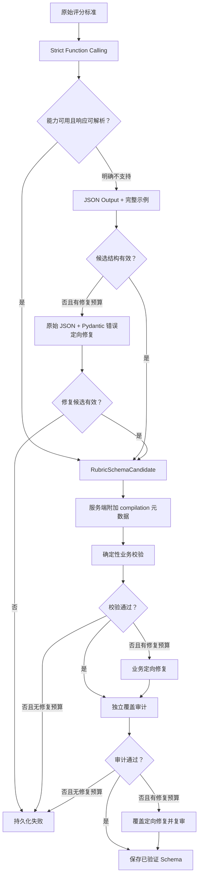

# Rubric Structured Output 与错误恢复设计

## 1. 背景

任务 `f99f8143-7744-4055-845a-a6c60ce4dd40` 在评分标准编译阶段失败。模型返回的是合法 JSON，但不符合 `RubricSchemaV2`：部分必填字段缺失、若干列表被返回为对象、维度列表为空，并且模型生成的编译元数据不完整。

当前调用只设置 DeepSeek `response_format={"type":"json_object"}`。该模式保证输出可以作为 JSON 解析，但不保证字段、类型和必填项满足应用的 JSON Schema。现有提示词又只描述顶层字段和业务规则，没有提供完整 Schema 或完整输出样例，因此模型会自行设计它认为合理的 JSON 结构。

失败信息已经保存在 `answer_generation_jobs.rubric_compilation` 中，但前端任务详情状态没有消费该字段。刷新页面或重新选择任务时，组件还会清除内存中的临时错误，导致持久化错误不可见。

## 2. 目标与非目标

### 2.1 目标

- 在供应商支持时，通过约束解码保证候选评分规则符合 JSON Schema。
- 在严格输出能力不可用时提供兼容降级，并允许一次结构定向修复。
- 将模型生成的业务内容与服务端生成的运行元数据分离。
- 保留现有确定性校验和独立覆盖审计，防止结构合法但语义错误的 Schema 进入生成阶段。
- 保持全管线最多一次修复的成本和延迟上限。
- 在刷新、轮询和重新选择任务后恢复持久化的评分标准分析错误。
- 向用户显示可理解的错误摘要，同时保留可展开的技术详情。

### 2.2 非目标

- 不改变答案生成与审核模型的调用方式。
- 不移除 Pydantic 或共享 TypeScript 校验。
- 不允许无限重试，也不自动放宽业务规则来接受错误结果。
- 不增加人工编辑 Rubric Schema 的页面。
- 不为所有 OpenAI 兼容供应商实现完整能力探测协议。

## 3. 方案选择

### 3.1 仅增强提示词

在现有 JSON Output 请求中加入完整示例，并在校验失败后重试。实现简单且兼容当前稳定端点，但结构正确性仍依赖模型遵循提示词，无法从机制上保证。

### 3.2 仅使用严格 Function Calling

通过 DeepSeek Beta Function Calling 的 `strict: true`、完整参数 Schema 和强制工具选择生成结果。结构保证最强，但如果 Beta 能力不可用、供应商返回不支持或严格 Schema 不被接受，任务会直接失败。

### 3.3 严格主路径加兼容降级

主路径使用严格 Function Calling；遇到明确的能力不支持错误时，降级到带完整示例的 JSON Output。降级结果若结构不合规，携带原始 JSON 和结构错误进行一次定向修复。

采用此方案。它在当前 DeepSeek 配置下优先获得结构保证，同时为 Beta 能力异常保留有限且可观测的退路。

## 4. 数据边界

### 4.1 模型候选与持久化 Schema 分离

新增内部候选模型 `RubricSchemaCandidate`，包含：

- `version`
- `role_prompt`
- `source_requirements`
- `global_constraints`
- `dimensions`
- `answer_principles`
- `retry_policy`
- `output_rules`
- `inferred_scores`

候选模型不包含 `compilation`。`compiler_model`、`auditor_model` 和 `coverage_passed` 属于执行事实，不应由模型猜测。`inferred_scores` 是关于评分标准内容的编译结论，因此保留为候选字段；服务端将它与真实模型名、审计状态一起组装成 `RubricCompilationMetadata`。

公开 API 和数据库仍保存完整的 `RubricSchemaV2`，不会改变 worker、生成器或审核器消费的契约。

### 4.2 严格输出 Schema

严格 Function 的参数使用从候选 Pydantic 模型导出的 JSON Schema，并在发送前规范化为 DeepSeek Strict Mode 接受的子集：

- 每个对象列出全部 `required` 字段。
- 每个对象设置 `additionalProperties: false`。
- 仅使用已支持的 object、array、string、integer、boolean、enum 和必要的 `anyOf`。
- 强制调用唯一的 `submit_rubric_schema` Function，不允许模型选择自然语言回复。

服务端从 `tool_calls[0].function.arguments` 读取候选内容，再执行 Pydantic 校验。严格模式只负责结构正确性，不替代业务校验。

当 `OPENAI_BASE_URL` 的主机名是 `api.deepseek.com` 时，严格调用使用官方要求的 `/beta` 基地址；其他 OpenAI 兼容地址直接使用 JSON Output 兼容路径。路径选择必须是确定性的，不通过先制造一次失败请求来探测能力。

## 5. 编译流程

结构修复、确定性校验修复和覆盖审计修复共享同一个修复预算。任何阶段一旦使用修复预算，后续阶段不能再次修复。这样维持现有“最多一次修复”的成本边界。

严格模式只在明确的“不支持该能力、Schema 或 Beta 端点”响应下触发兼容降级。超时、鉴权失败、限流和服务端故障继续按原错误失败，不用第二种协议重复请求，以免掩盖基础设施问题或产生不可控费用。

## 6. 提示词与修复输入

JSON Output 降级提示词必须包含：

- 完整的候选 JSON 样例，而不仅是顶层字段名称。
- 对数组和对象形状的明确说明。
- 稳定 ID、来源映射、分值和覆盖要求。
- “只返回候选业务字段，不返回 compilation”的约束。

结构修复调用接收原始评分标准、模型返回的原始 JSON、Pydantic 错误列表和完整候选样例。它只修复结构问题，不根据错误之外的内容新增业务规则。

错误详情持久化时保留阶段、错误码和安全的校验摘要。不得保存 API Key、Authorization Header、完整供应商响应头或其他凭据。

## 7. 前端错误恢复

### 7.1 数据契约

任务详情的前端类型补充 `rubricCompilation: RubricCompilationState | null`。GET 接口已经返回完整 job 记录，因此无需数据库迁移或新增查询。

### 7.2 状态分离

Dashboard 使用两个独立状态：

- `error`：当前页面操作产生的临时错误，例如保存题目失败。
- `rubricCompilationError`：从任务详情恢复的持久化评分标准分析错误。

加载任务详情时，根据 `job.rubricCompilation` 更新持久化错误，而不是依赖上一次请求的 `catch`。当编译阶段完成或新一轮编译开始时清除旧的持久化错误。静默轮询也必须更新该状态，使运行中的编译转为失败后无需刷新即可显示。

### 7.3 展示

错误区域显示：

- 用户可理解的 `message`
- 错误阶段 `stage`
- 稳定错误码 `code`
- 可展开的 `details.error` 技术详情

默认不展开长 Pydantic 错误，避免挤占工作区。技术详情保持原文，方便排障和反馈。

## 8. 错误分类

- `AI_SERVICE_TIMEOUT`：供应商调用超时，不降级协议。
- `AI_SERVICE_ERROR`：网络、鉴权、限流或服务端错误，不降级协议。
- `STRICT_OUTPUT_UNSUPPORTED`：严格能力、Beta 端点或严格 Schema 明确不支持，允许一次协议降级。
- `INVALID_MODEL_RESPONSE`：响应不可解析或候选结构错误；有修复预算时定向修复，否则失败。
- 现有业务校验码：继续由确定性校验产生。
- `COVERAGE_AUDIT_FAILED`：修复预算耗尽后覆盖审计仍失败。

最终失败继续写入 `rubric_compilation`，任务状态为 `failed`，未通过审计的 Schema 不写入 `rubric_schema`。

## 9. 测试策略

### 9.1 API

- 严格请求包含唯一 Function、完整参数 Schema、`strict: true` 和强制工具选择。
- 严格响应能解析为候选 Schema，服务端正确附加编译元数据。
- 明确不支持严格能力时降级到 JSON Output。
- 超时、鉴权或服务端错误不触发协议降级。
- JSON Output 的结构错误会携带原始 JSON 和 Pydantic 错误修复一次。
- 结构修复失败后返回 `INVALID_MODEL_RESPONSE`。
- 结构修复会消耗全管线唯一修复预算。
- 现有确定性校验、覆盖审计和失败测试继续通过。

### 9.2 Web

- 任务详情类型包含 `rubricCompilation`。
- 从失败任务详情可以生成稳定的用户错误摘要。
- 技术详情缺失时仍能正常展示摘要。
- 新一轮编译和成功状态会清除旧错误。
- 静默轮询从编译中转为失败时会显示持久化错误。

### 9.3 回归

- 运行 API 测试套件。
- 运行 workspace TypeScript 类型检查。
- 运行 shared、worker 和现有 Web 构建检查。

## 10. 验收标准

- 同类“合法 JSON 但字段形状错误”的响应不会在首次校验后立即失败；系统会通过严格约束避免该错误，或在兼容路径中定向修复一次。
- 所有模型生成候选都必须经过 Pydantic、确定性业务校验和独立覆盖审计。
- 任意一次编译最多使用一次修复调用。
- 任务失败信息在刷新、重新选择任务和静默轮询后仍可见。
- 用户无需阅读原始接口响应即可看到阶段、错误码和说明，并可按需展开技术详情。
- 现有已验证 Rubric Schema 的 worker、生成和审核流程保持兼容。
